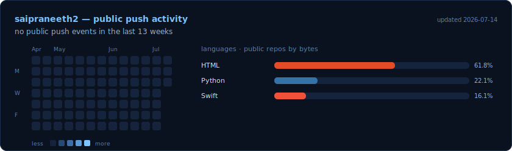

<!--
  Profile README for github.com/saipraneeth2
  · portrait.svg  — generated by scripts/ascii_portrait.py (from photo.jpg)
  · panel.svg     — generated by scripts/neofetch_panel.py
  · metrics.svg   — redrawn daily by .github/workflows/metrics.yml
  Full setup order: see SETUP.md

  Layout note: the two cards below use fixed pixel widths inside a centered
  div instead of an HTML table — that way they sit side by side on desktop
  and wrap into a stacked column on mobile (table cells never stack).
-->

  
  

## This week in commits

Redrawn every day by a <a href=".github/workflows/metrics.yml">scheduled GitHub Action</a> — dependency-free Python, built-in <code>GITHUB_TOKEN</code>, no external services.

## Featured work

| Project | About |
| --- | --- |
| [**OpsIQ**](https://github.com/saipraneeth2/OpsIQ) | AI-powered operations platform that turns existing CCTV and POS into a nightly verified-sales and staff-performance report for multi-store owners. `Python` |
| [**SheSafe (watchOS)**](https://github.com/saipraneeth2/SheSafe_WatchOS) | Apple Watch women's-safety app — triple-press the Digital Crown to trigger an emergency SOS call with a 5-second haptic countdown. `Swift · SwiftUI` |
| [**saipraneeth2.github.io**](https://github.com/saipraneeth2/saipraneeth2.github.io) | Portfolio site and resume, live at <a href="https://saipraneeth2.github.io">saipraneeth2.github.io</a>. `HTML` |

  Fort Collins, CO · <a href="https://saipraneeth2.github.io">portfolio</a> · open to Business / Data Analyst roles

